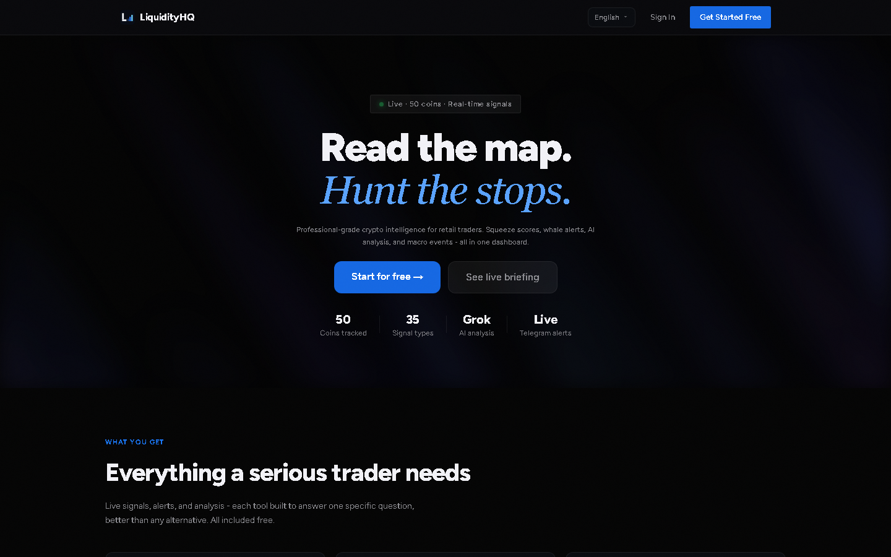
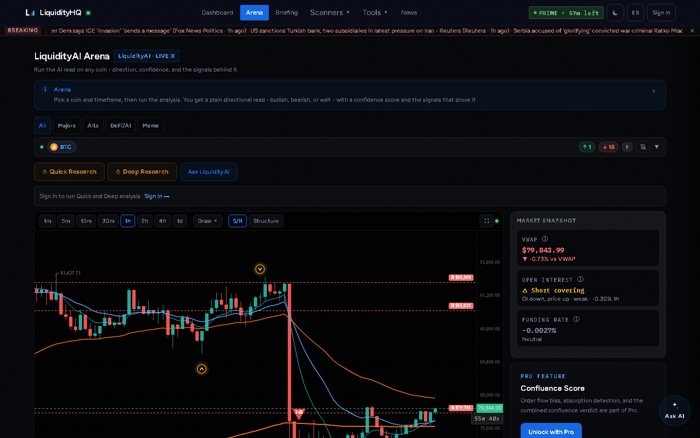

# LiquidityHQ

**Crypto trading intelligence in one dashboard.** LiquidityHQ tracks 50 coins across
Binance and Bybit and turns raw market data into things a trader can act on: where
liquidations have actually happened and clustered, which trading session is live and
what that historically means for volatility, what just broke in the news, and an AI
read on any coin with the signals behind it. It exists because the same questions —
*where is the liquidity, is this move real, what did I miss overnight* — were being
answered by hand across six browser tabs.

**Live at [liquidity-hq.com](https://liquidity-hq.com).** No sign-in needed to look
around; the AI analysis and alerting are behind an account.





---

## What it does

- **Live market data for 50 coins** — prices, funding rates, open interest, long/short
  ratios and aggregated trades, pulled from Binance and Bybit and served through a
  caching proxy layer rather than from the browser.
- **Realized liquidation clusters** — a live WebSocket feed of liquidation events from
  both exchanges, accumulated over 24 hours into price buckets and drawn on the chart
  as levels. These are liquidations that *already happened*, not predicted levels.
- **AI analysis (Grok)** — a per-coin directional read with a confidence score and the
  evidence that produced it, plus a generated market briefing and a chat that can be
  asked about a specific coin.
- **Breaking news** — RSS and Finnhub feeds ingested server-side once per minute and
  pushed to clients over Supabase Realtime, so the ticker is not fifty browsers polling.
- **Alerts** — price alerts you drag onto the chart, plus Telegram and web-push delivery.
- **Trading session windows** — which of the Asia/London/New York sessions is open, and
  the volume characteristics that go with each.
- **Economic calendar** — scheduled macro events, with estimated dates marked as
  estimated rather than presented as scheduled.
- **Scanner, correlation, funding and backtest tools**, plus a trade journal.
- **Installable** — PWA with offline support, and an Android build via Capacitor.

## Architecture

**Next.js 16 (App Router) with React 19 and TypeScript**, deployed on Render. There is
no separate backend: 74 API routes under `app/api/` do the server-side work,
and Supabase provides Postgres, auth and Realtime.

The interesting part is the data layer, which exists because the naive version got the
server's IP rate-limited:

- **One shared worker pool** (`lib/pool.ts`) — a fixed-size pool at concurrency 12
  fronting every upstream fan-out. It was written twice in two routes before it was
  extracted once; the stop condition is a caller-supplied predicate rather than an
  exception type, which is what let one pool serve both Binance and Bybit.
- **Server-side fan-out behind a shared cache** (`lib/bybitFanout.ts`) — Bybit's
  per-symbol endpoints take one symbol per request and have no batch parameter. Rather
  than proxying that loop, the fan-out happens once behind a single cache entry per
  `(endpoint, params)`, with single-flight so a burst at TTL expiry produces one
  fan-out instead of one per visitor. **A browser goes from ~50 requests to 1.** Upstream
  still pays the fan-out once per TTL window — the saving there scales with how many
  visitors share a window, and is not a fixed multiple.
- **Push, not poll, for news** — clients subscribe to a Supabase Realtime table that a
  scheduled ingest writes to.

Tests are `node:test` for units and Playwright for end-to-end, run against a deployed
environment rather than a mock.

## Tech stack

| | |
|---|---|
| Framework | Next.js 16 · React 19 · TypeScript 5 |
| Styling | Tailwind CSS 4 |
| Charts | KLineCharts 10 (beta) |
| Backend | Supabase (Postgres, auth, Realtime) |
| AI | Grok (xAI) |
| Market data | Binance · Bybit · Coinbase · CoinMarketCap · Finnhub |
| Notifications | Web Push (VAPID) · Telegram Bot API |
| Mobile | Capacitor (Android) |
| Monitoring | Sentry · PostHog |
| Testing | node:test · Playwright · axe-core |
| Hosting | Render |

## Getting started

Requires Node 20.9 or newer (Next.js 16's own floor) and a package manager of your choice.

```bash
npm install
cp .env.example .env.local   # then fill in the values you need
npm run dev
```

Open [http://localhost:3000](http://localhost:3000).

**Most of the app runs without any credentials.** Live prices, the scanner, session
hours and the liquidation feed all read public endpoints. `.env.example` documents
what each variable unlocks — Supabase enables accounts and signal history, and the
AI features need a Grok key.

Other useful scripts:

```bash
npm run lint        # ESLint
npm run typecheck   # tsc --noEmit
npm test            # unit tests
npm run test:e2e    # Playwright
npm run build       # production build
```

## Deployment

Hosted on Render across four services, one per branch. **None of them auto-deploy** —
merging ships nothing until a deploy is triggered manually from the Render dashboard.

| Branch | Service | URL |
|---|---|---|
| `main` | `liquidity-hq` | https://liquidity-hq.com |
| `staging` | `liquidity-hq-staging` | https://liquidity-hq-staging.onrender.com |
| `qa` | `liquidity-hq-qa` | https://liquidity-hq-qa.onrender.com |
| `dev` | `liquidity-hq-dev` | https://liquidity-hq-dev.onrender.com |

Work flows `dev` → `qa` → `staging` → `main`. `/api/version` on any environment reports
the commit and branch it is actually serving, which is the only reliable answer to
"what is deployed right now" when deploys are manual.

See `CONTRIBUTING.md` and `docs/INFRASTRUCTURE.md` for the full process.

## License

**No license is currently declared**, which means default copyright applies and the code
is not yet reusable by others. If this repository is intended as an open-source
showcase, a license needs to be chosen and added.
